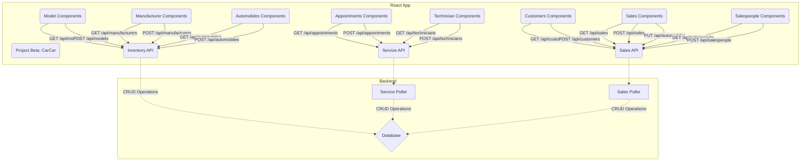

# CarCar

Team:

**Adam K** - Service
**Joshua S** - Sales

## How to Run this App

**Pre-Reqs: Git, Docker**
​
1. Fork this repository; clone its files to your local machine using the terminal command below:
- `git clone <<Clone with HTTPS link>>`
​
2. Build and run the project with the following Docker commands in your terminal:
```
docker volume create beta-data
docker-compose build
docker-compose up
```
3. Verify that each Docker container is running; there should be (7) in total:
- database-1
- react-1
- inventory-api-1
- service-api-1
- service-poller-1
- sales-api-1
- sales-poller-1
​
4. You can view the CarCar web app in your browser @ http://localhost:3000/.
​
## Diagram


​
## API Documentation

### URLs and Ports

1. CarCar Web App:
- http://localhost:3000/

2. Inventory API:
- http://localhost:8100/api/

3. Service API:
- http://localhost:8080/api/

4. Sales API:
- http://localhost:8090/api/

## Inventory Microservice

### Inventory API

## Service microservice

Explain your models and integration with the inventory
microservice, here.

### Service API
 - Put Service API documentation here

## Sales microservice

This microservice consists of 4 models:
- customers
- salespersons
- sales
- AutomobileVOs
These models are integrated into 3 REST API methods GET, POST, DELETE
My AutomobileVO model relies on data from an existing Automobile model in another Django project.
in order to retrieve this data I use a poller script which successfully querys data using an API endpoint "...inventory-api:8000/api/automobiles"
This poller will only function if ALLOWED_HOSTS in both projects has each respective services name listed. These names can be found in docker-compose.yaml files

This microservice now consists of 6 React components on the frond end:
- CustomerForm (allows the user to create a new customer)
- CustomerList (allows the user to view a list of all customers)
- SalesForm    (allows the user to create a new Sale by selecting only unsold automobiles and corresponding customer, salesperson, and price)
- SalesList    (allows the user to view a list of all sales made by automobile vin and price)
- SalesPersonForm (allows the user to create a new Salesperson)
- SalesPersonList (allows the user to view a list of all salespersons)
- SalesPersonSalesHistory (allows the user to view a list of all sales made by specific salespersons, a useful TPI/performance tracking metric)

UI/Design is basic with some bootstrap mix-ins. Will improve tomorrow.

### Sales API

```
+------------------------------------------------------------------------------------------------------------------------------------------+
| +-------------------------------+--------+-----------------------------------------+                                                     |
| |           Action              | Method |                 URL                     |                                                     |
| +-------------------------------+--------+-----------------------------------------+                                                     |
| | List Salespeople              | GET    | http://localhost:8090/api/salespeople/  |                                                     |
| | Create a Salesperson          | POST   | http://localhost:8090/api/salespeople/  |                                                     |
| | Delete a Specific Salesperson | DELETE | http://localhost:8090/api/salespeople/:id/                                                    |
| | List Customers                | GET    | http://localhost:8090/api/customers/    |                                                     |
| | Create a Customer             | POST   | http://localhost:8090/api/customers/    |                                                     |
| | Delete a Specific Customer    | DELETE | http://localhost:8090/api/customers/:id/|                                                     |
| | List Sales                    | GET    | http://localhost:8090/api/sales/        |                                                     |
| | Create a Sale                 | POST   | http://localhost:8090/api/sales/        |                                                     |
| | Delete a Specific Sale        | DELETE | http://localhost:8090/api/sales/:id/    |                                                     |
| +-------------------------------+--------+-----------------------------------------+                                                     |
| +-----------------------+--------+------------------------------------------------------------+                                          |
| |        Action        | Method |              JSON Body - Example                           |                                           |
| +-----------------------+--------+------------------------------------------------------------+                                          |
| | Create a Salesperson | POST   | {"first_name": "John", "last_name": "Doe", "employee_id": "jdoe"} |                                    |
| | Create a Customer    | POST   | {"first_name": "Jane", "last_name": "Doe", "address": "123 Main St", "phone_number": "123-456-7890"} | |
| | Create a Sale        | POST   | {"automobile": 1, "salesperson": 1, "customer": 1, "price": 20000} |                                   |
| +-----------------------+--------+------------------------------------------------------------+                                          |
+------------------------------------------------------------------------------------------------------------------------------------------+
```


## Value Objects
```
+-------------------------------------------------------------------------------+
|                                 AutomobileVO                                  |
+-------------------------------------------------------------------------------+
| This model contains the following fields:                                     |
| - `vin`: The vehicle identification number, which is unique for every vehicle |
| - `sold`: A boolean field that indicates if the vehicle has been sold         |
+-------------------------------------------------------------------------------+
```

