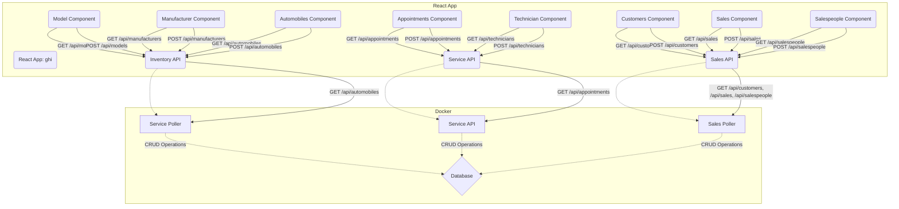

# CarCar
```
 ________   ________   ________   ________   ________   ________
|\   ____\ |\   __  \ |\   __  \ |\   ____\ |\   __  \ |\   __  \
\ \  \___| \ \  \|\  \\ \  \|\  \\ \  \___| \ \  \|\  \\ \  \|\  \
 \ \  \     \ \   __  \\ \   _  _\\ \  \     \ \   __  \\ \   _  _\
  \ \  \____ \ \  \ \  \\ \  \\  \|\ \  \____ \ \  \ \  \\ \  \\  \|
   \ \_______\\ \__\ \__\\ \__\\ _\ \ \_______\\ \__\ \__\\ \__\\ _\
    \|_______| \|__|\|__| \|__|\|__| \|_______| \|__|\|__| \|__|\|__|

```
Project Team:
    - **Adam K** - Service
    - **Joshua S** - Sales

## How to Run this App

**Pre-reqs: Git, Docker**
​
1. Fork the repository; clone its files to your local machine using the terminal command below:
    - `git clone <<Clone with HTTPS link>>`
​
2. Build and run the project with the following Docker commands in your terminal:
    ```
    docker volume create beta-data
    docker-compose build
    docker-compose up
    ```
3. Verify that each Docker container is running; there should be (7) in total:
    - database-1
    - react-1
    - inventory-api-1
    - service-api-1
    - service-poller-1
    - sales-api-1
    - sales-poller-1
​
4. You can view the CarCar web app in your browser @ http://localhost:3000/.
​
## Diagram


​
# API Documentation

## URLs and Ports

1. CarCar Web App:
    - http://localhost:3000/

2. Inventory API:
    - http://localhost:8100/api/

3. Service API:
    - http://localhost:8080/api/

4. Sales API:
    - http://localhost:8090/api/

## Inventory Microservice

For this microservice, we utilized the following models (and properties) listed below:
1. Model: 'Manufacturer'
    - name
2. Model: 'VehicleModel'
    - name
    - picture_url
    - manufacturer (foreign-key)
3. Model: 'Automobile'
    - color
    - year
    - vin
    - sold
    - model (foreign-key)

The Inventory microservice is integrated to both the Service and Sales microservices through their respective pollers (service-poller-1, sales-poller-1). This helps with the scalability of each microservice and simplifies the management of each database. Overall, this microservice is designed to help dealerships manage a varied and dynamic inventory while communicating changes to both its Service and Sales branches.

### Inventory API

**Manufacturers**
```
+--------------------------------+--------+----------------------------------------------+
|             Action             | Method |                     URL                      |
+--------------------------------+--------+----------------------------------------------+
| List Manufacturers             | GET    | http://localhost:8100/api/manufacturers/     |
| Create a manufacturer          | POST   | http://localhost:8100/api/manufacturers/     |
| Get a Specific Manufacturer    | GET    | http://localhost:8100/api/manufacturers/:id/ |
| Update a Specific Manufacturer | PUT    | http://localhost:8100/api/manufacturers/:id/ |
| Delete a Specific Manufacturer | DELETE | http://localhost:8100/api/manufacturers/:id/ |
+--------------------------------+--------+----------------------------------------------+
+--------------------------------+--------+----------------------+
|             Action             | Method | JSON Body - Example  |
+--------------------------------+--------+----------------------+
| Create a Manufacturer          | POST   | {"name": "Chrysler"} |
| Update a Specific Manufacturer | PUT    | {"name": "Honda"}    |
+--------------------------------+--------+----------------------+
```
**Models**
```
+---------------------------------+--------+---------------------------------------+
|             Action              | Method |                  URL                  |
+---------------------------------+--------+---------------------------------------+
| List Vehicle Models             | GET    | http://localhost:8100/api/models/     |
| Create a Vehicle Model          | POST   | http://localhost:8100/api/models/     |
| Get a Specific Vehicle Model    | GET    | http://localhost:8100/api/models/:id/ |
| Update a Specific Vehicle Model | PUT    | http://localhost:8100/api/models/:id/ |
| Delete a Specific Vehicle Model | DELETE | http://localhost:8100/api/models/:id/ |
+---------------------------------+--------+---------------------------------------+
+----------------------------------+----------+-----------------------------------------------------------------------------+
|             Action               |  Method  |                             JSON Body - Example                             |
+----------------------------------+----------+-----------------------------------------------------------------------------+
| Create a Vehicle Model           |  POST    |  {"name": "Sebring", "picture_url": "<<Insert URL>>", "manufacturer_id": 1} |
| Update a Specific Vehicle Model  |  PUT     |  {"name": "Civic", "picture_url": "<<Insert URL>>", "manufacturer_id": 2}   |
+----------------------------------+----------+-----------------------------------------------------------------------------+
```
**Automobiles**
```
+------------------------------+--------+---------------------------------------------+
|            Action            | Method |                     URL                     |
+------------------------------+--------+---------------------------------------------+
| List Automobiles             | GET    | http://localhost:8100/api/automobiles/      |
| Create an Automobile         | POST   | http://localhost:8100/api/automobiles/      |
| Get a Specific Automobile    | GET    | http://localhost:8100/api/automobiles/:vin/ |
| Update a Specific Automobile | PUT    | http://localhost:8100/api/automobiles/:vin/ |
| Delete a Specific Automobile | DELETE | http://localhost:8100/api/automobiles/:vin/ |
+------------------------------+--------+---------------------------------------------+
+-------------------------------+----------+-----------------------------------------------------------------------------+
|            Action             |  Method  |                             JSON Body - Example                             |
+-------------------------------+----------+-----------------------------------------------------------------------------+
| Create an Automobile          |  POST    |  {"color": "red", "year": 2012, "vin": "1C3CC5FB2AN120174", "model_id": 2}  |
| Update a Specific Automobile  |  PUT     |  {"color": "blue", "year": 2014, "vin": "1C4CC6FB3AN231285", "model_id": 2} |
+-------------------------------+----------+-----------------------------------------------------------------------------+
```

### Inventory Front-End
```
+------------------------------------------+------------------------+---------------------------------------------------------------------+
|             Web App Address              |    React Component     |                             Description                             |
+------------------------------------------+------------------------+---------------------------------------------------------------------+
| http://localhost:3000/automobile-list/   |  AutomobileList.js     |  Allows users to view all automobiles in inventory (sold & unsold). |
| http://localhost:3000/automobile-form/   |  AutomobileForm.js     |  Allows users to create a new automobile for inventory VIA a form.  |
| http://localhost:3000/models/            |  ModelList.js          |  Allows users to view all vehicle models.                           |
| http://localhost:3000/models/create/     |  ModelForm.js          |  Allows users to create a new vehicle model VIA a form.             |
| http://localhost:3000/manufacturer-list/ |  ManufacturerList.js   |  Allows users to view all manufacturers.                            |
| http://localhost:3000/manufacturer-form/ |  ManufacturerForm.js   |  Allows users to create a new manufacturer VIA a form.              |
+------------------------------------------+------------------------+---------------------------------------------------------------------+
```

## Service Microservice

For this microservice, we utilized the following models (and properties) listed below:
1. Model: 'Technician'
    - first_name
    - last_name
    - employee_id
2. Model: 'Appointment'
    - date_time
    - reason
    - status
    - vin
    - customer
    - technician (foreign-key)
    - vip
3. Model: 'Automobile VO'
    - vin
    - sold

We were able to integrate with the Inventory microservice through the ‘AutomobileVO’ model (value object) containing both vin and sold properties. Our microservice's poller (service-poller-1) pings the Inventory's Automobile API @ "http://project-beta-inventory-api-1:8000/api/automobiles/" every 60 seconds to look for any new (or updated) data.

Ultimately, this setup (along with the 'vip' property on the 'Appointment' model) allows us to determine if a customer's vehicle was in our inventory (meaning it has been sold). It also allows us to avoid any synchronization issues that may occur from attempting to maintain 'Automobile' entities over multiple databases.

### Service API
```
+--------------------------------------+--------+----------------------------------------------------+
|                Action                | Method |                        URL                         |
+--------------------------------------+--------+----------------------------------------------------+
| List Technicians                     | GET    | http://localhost:8080/api/technicians/             |
| Create a Technician                  | POST   | http://localhost:8080/api/technicians/             |
| Delete a Specific Technician         | DELETE | http://localhost:8080/api/technicians/:id/         |
| List Appointments                    | GET    | http://localhost:8080/api/appointments/            |
| Create an Appointment                | POST   | http://localhost:8080/api/appointments/            |
| Delete an Appointment                | DELETE | http://localhost:8080/api/appointments/:id/        |
| Set Appointment Status to 'canceled' | PUT    | http://localhost:8080/api/appointments/:id/cancel/ |
| Set Appointment Status to 'finished' | PUT    | http://localhost:8080/api/appointments/:id/finish/ |
+--------------------------------------+--------+----------------------------------------------------+
+-------------------------------------------+----------+-------------------------------------------------------------------------------------------------------------------------------------------------+
|                  Action                   |  Method  |                                                               JSON Body - Example                                                               |
+-------------------------------------------+----------+-------------------------------------------------------------------------------------------------------------------------------------------------+
| Create a Technician                       |  POST    |  {"first_name": "John", "last_name": "Appleseed", "employee_id": "jappleseed"}                                                                  |
| Create an Appointment                     |  POST    |  {"date_time": "2011-11-04T00:10:00", "reason": "Brake Replacement", "vin": "1C3CC5FB2AN120174", "customer": "Jane Appleseed", "technician": 1} |
| Set an Appointment Status to 'canceled'   |  PUT     |  N/A - JSON Body should be empty.                                                                                                               |
| Set an Appointment Status to 'finished'   |  PUT     |  N/A - JSON Body should be empty.                                                                                                               |
+-------------------------------------------+----------+-------------------------------------------------------------------------------------------------------------------------------------------------+
```
### Service Front-End
```
+----------------------------------------------+----------------------+----------------------------------------------------------------------------------+
|               Web App Address                |   React Component    |                                    Description                                   |
+----------------------------------------------+----------------------+----------------------------------------------------------------------------------+
| http://localhost:3000/technicians/           |  TechnicianList.js   |  Allows users to view all technicians.                                           |
| http://localhost:3000/technicians/create/    |  TechnicianForm.js   |  Allows users to create a new technician VIA a form.                             |
| http://localhost:3000/appointments/          |  AppointmentList.js  |  Allows users to view active appointments and alter an appointment's status.     |
| http://localhost:3000/appointments/create/   |  AppointmentForm.js  |  Allows users to create a new appointment VIA a form.                            |
| http://localhost:3000/appointments/history/  |  ServiceHistory.js   |  Allows users to view all appointments (regardless of status) and search by VIN. |
+----------------------------------------------+----------------------+----------------------------------------------------------------------------------+
```
## Sales Microservice

For this microservice, we utilized the following models (and properties) listed below:
1. Model: 'Salesperson'
    - first_name
    - last_name
    - employee_id
2. Model: 'Customer'
    - first_name
    - last_name
    - address
    - phone_number
3. Model: 'AutomobileVO'
    - vin
    - sold
4. Model: 'Sale'
    - automobile (foreign-key)
    - salesperson (foreign-key)
    - customer (foreign-key)
    - price

These models are integrated into 3 REST API methods GET, POST, DELETE. The AutomobileVO model relies on data from an existing Automobile model in another Django project.
In order to retrieve this data we used a poller script which successfully queries data using an API endpoint "...inventory-api:8000/api/automobiles".
This poller will only function if ALLOWED_HOSTS in both projects has each respective services name listed. These names can be found in docker-compose.yaml files.

### Sales API
```
+--------------------------------+----------+---------------------------------------------+
|            Action              |  Method  |                     URL                     |
+--------------------------------+----------+---------------------------------------------+
| List Salespeople               |  GET     |  http://localhost:8090/api/salespeople/     |
| Create a Salesperson           |  POST    |  http://localhost:8090/api/salespeople/     |
| Delete a Specific Salesperson  |  DELETE  |  http://localhost:8090/api/salespeople/:id/ |
| List Customers                 |  GET     |  http://localhost:8090/api/customers/       |
| Create a Customer              |  POST    |  http://localhost:8090/api/customers/       |
| Delete a Specific Customer     |  DELETE  |  http://localhost:8090/api/customers/:id/   |
| List Sales                     |  GET     |  http://localhost:8090/api/sales/           |
| Create a Sale                  |  POST    |  http://localhost:8090/api/sales/           |
| Delete a Specific Sale         |  DELETE  |  http://localhost:8090/api/sales/:id/       |
+--------------------------------+----------+---------------------------------------------+
+-----------------------+----------+-------------------------------------------------------------------------------------------------------+
|        Action         |  Method  |                                          JSON Body - Example                                          |
+-----------------------+----------+-------------------------------------------------------------------------------------------------------+
| Create a Salesperson  |  POST    |  {"first_name": "John", "last_name": "Doe", "employee_id": "jdoe"}                                    |
| Create a Customer     |  POST    |  {"first_name": "Jane", "last_name": "Doe", "address": "123 Main St", "phone_number": "123-456-7890"} |
| Create a Sale         |  POST    |  {"automobile": 1, "salesperson": 1, "customer": 1, "price": 20000}                                   |
+-----------------------+----------+-------------------------------------------------------------------------------------------------------+
```

### Sales Front-End
```
+--------------------------------------------+-------------------------+-------------------------------------------------------------------------------------------+
|              Web App Address               |     React Component     |                                        Description                                        |
+--------------------------------------------+-------------------------+-------------------------------------------------------------------------------------------+
| http://localhost:3000/salespeople-create/  |  SalesPersonForm.js     |  Allows users to create a salesperson VIA a form.                                         |
| http://localhost:3000/salespeople-list/    |  SalesPersonsList.js    |  Allows users to view all salespersons.                                                   |
| http://localhost:3000/customer-form/       |  CustomerForm.js        |  Allows users to create a customer VIA a form.                                            |
| http://localhost:3000/customer-list/       |  CustomerList.js        |  Allows users to view all customers.                                                      |
| http://localhost:3000/sale-form/           |  SaleForm.js            |  Allows users to create a sale for a specific automobile/salesperson/customer VIA a form. |
| http://localhost:3000/sale-list/           |  SaleList.js            |  Allows users to view all sales.                                                          |
| http://localhost:3000/salesperson-history/ |  SalesPersonHistory.js  |  Allows users to view sales for a specific salesperson.                                   |
+--------------------------------------------+-------------------------+-------------------------------------------------------------------------------------------+
```

## Value Objects
    - Inventory Microservice
        -- None
    - Service Microservice
        -- Model: 'AutomobileVO'
            --- Properties: 'vin', 'sold'
            --- This VO allows us to determine if a customer's appointment is eligible for VIP discounts i.e. they purchased their car from inventory.
    - Sales Microservice
        -- Model: 'AutomobileVO'
            --- Properties: 'vin', 'sold'
            --- This VO allows us to relay sales information to the Inventory microservice by updating the 'sold' property on an Automobile entity.
