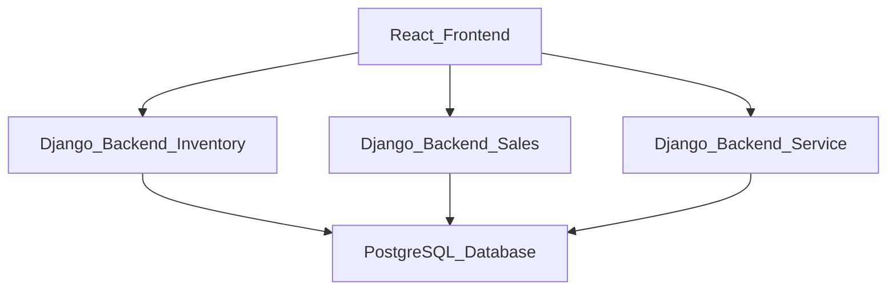

# CarCar

Team:

**Adam K** - Service
**Joshua S** - Sales

## How to Run this App

**Pre-Reqs: Git, Docker**
​
1. Fork this repository; clone its files to your local machine using the terminal command below:
- `git clone <<Clone with HTTPS link>>`
​
2. Build and run the project with the following Docker commands in your terminal:
```
docker volume create beta-data
docker-compose build
docker-compose up
```
3. Verify that each Docker container is running; there should be (7) in total:
- database-1
- react-1
- inventory-api-1
- service-api-1
- service-poller-1
- sales-api-1
- sales-poller-1
​
4. You can view the CarCar web app in your browser @ http://localhost:3000/.
​
## Diagram


​
## API Documentation

### URLs and Ports

1. CarCar Web App:
- http://localhost:3000/

2. Inventory API:
- http://localhost:8100/api/

3. Service API:
- http://localhost:8080/api/

4. Sales API:
- http://localhost:8090/api/

## Inventory Microservice

### Inventory API

## Service microservice

Explain your models and integration with the inventory
microservice, here.

### Service API
 - Put Service API documentation here

## Sales microservice

This microservice consists of 4 models:
- customers
- salespersons
- sales
- AutomobileVOs
These models are integrated into 3 REST API methods GET, POST, DELETE
My AutomobileVO model relies on data from an existing Automobile model in another Django project.
in order to retrieve this data I use a poller script which successfully querys data using an API endpoint "...inventory-api:8000/api/automobiles"
This poller will only function if ALLOWED_HOSTS in both projects has each respective services name listed. These names can be found in docker-compose.yaml files

This microservice now consists of 6 React components on the frond end:
- CustomerForm (allows the user to create a new customer)
- CustomerList (allows the user to view a list of all customers)
- SalesForm    (allows the user to create a new Sale by selecting only unsold automobiles and corresponding customer, salesperson, and price)
- SalesList    (allows the user to view a list of all sales made by automobile vin and price)
- SalesPersonForm (allows the user to create a new Salesperson)
- SalesPersonList (allows the user to view a list of all salespersons)
- SalesPersonSalesHistory (allows the user to view a list of all sales made by specific salespersons, a useful TPI/performance tracking metric)

UI/Design is basic with some bootstrap mix-ins. Will improve tomorrow.

### Sales API

+--------------------------------------------------------------------------------------------------------------------------------------------------------------------------------------------------------------------------------------------------------------------------------------------------------------------------------------------+
|                                                                                                                                                          Sales API Documentation                                                                                                                                                           |
+--------------------------------------------------------------------------------------------------------------------------------------------------------------------------------------------------------------------------------------------------------------------------------------------------------------------------------------------+
| Introduction                                                                                                                                                                                                                                                                                                                               |
| This document provides detailed explanations on the sales-api microservice's endpoints. This API is responsible for creating, retrieving, and deleting sales records, along with details of salespeople and customers.                                                                                                                     |
| The sales-api service listens on port 8090, and it is available at http://localhost:8090 or http://sales-api:8000 within the Docker environment.                                                                                                                                                                                           |
| Models                                                                                                                                                                                                                                                                                                                                     |
| The sales-api microservice defines four models: Salesperson, Customer, AutomobileVO, and Sale.                                                                                                                                                                                                                                             |
| Salesperson                                                                                                                                                                                                                                                                                                                                |
| This model contains the following fields:                                                                                                                                                                                                                                                                                                  |
| first_name: The salesperson's first name                                                                                                                                                                                                                                                                                                   |
| last_name: The salesperson's last name                                                                                                                                                                                                                                                                                                     |
| employee_id: A unique identifier for the salesperson                                                                                                                                                                                                                                                                                       |
| Customer                                                                                                                                                                                                                                                                                                                                   |
| This model contains the following fields:                                                                                                                                                                                                                                                                                                  |
| first_name: The customer's first name                                                                                                                                                                                                                                                                                                      |
| last_name: The customer's last name                                                                                                                                                                                                                                                                                                        |
| address: The customer's address                                                                                                                                                                                                                                                                                                            |
| phone_number: The customer's phone number                                                                                                                                                                                                                                                                                                  |
| AutomobileVO                                                                                                                                                                                                                                                                                                                               |
| This model contains the following fields:                                                                                                                                                                                                                                                                                                  |
| vin: The vehicle identification number, which is unique for every vehicle                                                                                                                                                                                                                                                                  |
| sold: A boolean field that indicates if the vehicle has been sold                                                                                                                                                                                                                                                                          |
| Sale                                                                                                                                                                                                                                                                                                                                       |
| This model contains the following fields:                                                                                                                                                                                                                                                                                                  |
| automobile: A foreign key to the AutomobileVO model                                                                                                                                                                                                                                                                                        |
| salesperson: A foreign key to the Salesperson model                                                                                                                                                                                                                                                                                        |
| customer: A foreign key to the Customer model                                                                                                                                                                                                                                                                                              |
| price: The price at which the vehicle was sold                                                                                                                                                                                                                                                                                             |
| Endpoints                                                                                                                                                                                                                                                                                                                                  |
| The API consists of several endpoints that perform different functions:                                                                                                                                                                                                                                                                    |
| Salespeople                                                                                                                                                                                                                                                                                                                                |
| GET /salespeople/: Returns a list of all salespeople.                                                                                                                                                                                                                                                                                      |
| POST /salespeople/: Creates a new salesperson. The request body must contain a JSON object with first_name, last_name, and employee_id fields.                                                                                                                                                                                             |
| GET /salespeople/{id}/: Returns the details of a specific salesperson. Replace {id} with the id of the salesperson.                                                                                                                                                                                                                        |
| DELETE /salespeople/{id}/: Deletes a specific salesperson. Replace {id} with the id of the salesperson.                                                                                                                                                                                                                                    |
| Customers                                                                                                                                                                                                                                                                                                                                  |
| GET /customers/: Returns a list of all customers.                                                                                                                                                                                                                                                                                          |
| POST /customers/: Creates a new customer. The request body must contain a JSON object with first_name, last_name, address, and phone_number fields.                                                                                                                                                                                        |
| GET /customers/{id}/: Returns the details of a specific customer. Replace {id} with the id of the customer.                                                                                                                                                                                                                                |
| DELETE /customers/{id}/: Deletes a specific customer. Replace {id} with the id of the customer.                                                                                                                                                                                                                                            |
| Sales                                                                                                                                                                                                                                                                                                                                      |
| GET /sales/: Returns a list of all sales.                                                                                                                                                                                                                                                                                                  |
| POST /sales/: Creates a new sale. The request body must contain a JSON object with automobile, salesperson, customer, and price fields. automobile, salesperson, and customer must be the respective model ids.                                                                                                                            |
| GET /sales/{id}/: Returns the details of a specific sale. Replace {id} with the id of the sale.                                                                                                                                                                                                                                            |
| DELETE /sales/{id}/: Deletes a specific sale. Replace {id} with the id of the sale.                                                                                                                                                                                                                                                        |
| Notes                                                                                                                                                                                                                                                                                                                                      |
| This microservice is part of a broader system that includes other services like inventory-api and service-api. Therefore, some operations might require inter-service communication. For example, when creating a new sale, the sales-api needs to update the sold field of the AutomobileVO model, which is managed by the inventory-api. |
+--------------------------------------------------------------------------------------------------------------------------------------------------------------------------------------------------------------------------------------------------------------------------------------------------------------------------------------------+


## Value Objects
 - Identification of value objects for each service goes here
